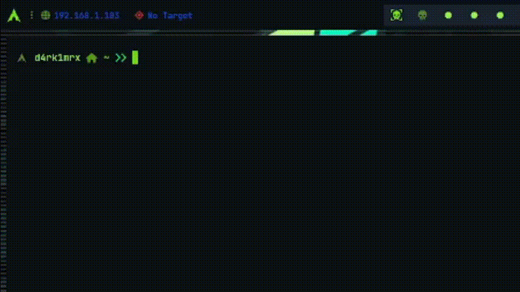

    
    

<h1 align="center">Hola , Soy D4rk1MRX</h1>

   

## Sobre Mi:

- 🎓 Soy estudiante de informatica
- 🎓 Un futuro en la cyberseguridad
- ⚡ **Diversiones** : 🍕 🏉 🏏 🎥 🚞

 

## Connect with me ☕ :

 

 

## What I am Good at 🧑‍💻 :

 

     

    

    

 

## GitHub Stats 📈 :

 

 

 

## GitHub Thropies 🏆 :

 

 

Last edited on: 16/08/2024
